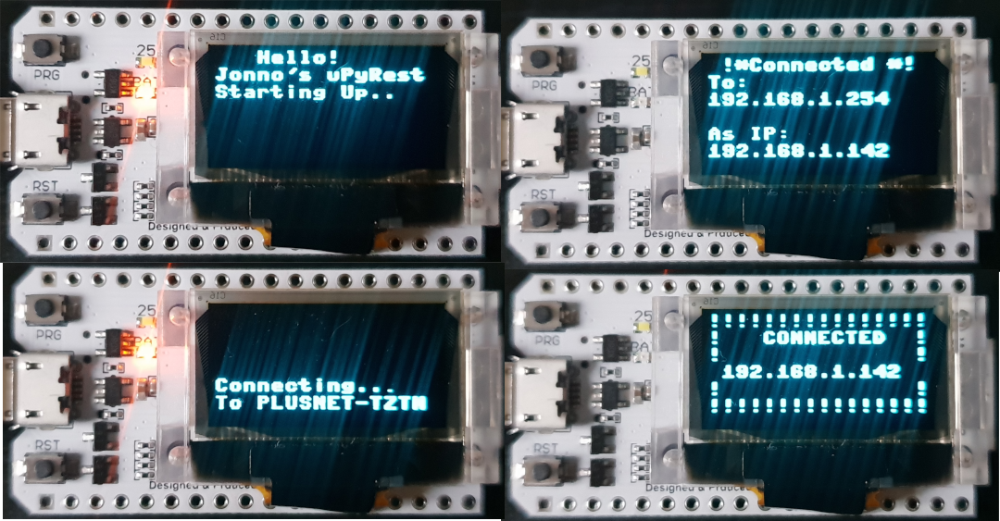

# uPyRest
An 'uRestful' server for Micro Python -> ESP32



## Introduction

This is a framework for the ESP32. It provides a confgiuration file based
setup for a simple RESTful web service.

A `config.json` file is placed in the root directory and the `installer.py` run
to set up the device.

## Device Setup

### Dependencies:

0. ***Python3***

1. ***Ampy*** (https://github.com/adafruit/ampy)

2. ***MicroPython(uPython) (1.9.4)*** : (https://micropython.org/download)

3. ***esptool*** : (https://github.com/espressif/esptool)

4. ***Optional:Putty (Command Line)*** but you can use your own Serial Com tool such as Minicom / Telnet.

5. An ***ESP32 based board***. Preferably with the higher RAM and 240MHz clock.

### Installing uPython on to the ESP32

1. Plug the ESP32 in to a USB port (pref USB 2+).

2. Check the device is identified by the system 
        
        Run `ls /dev/ttyUSB*` for linux

        Check the `Device Manager` for Windows : May need to ensure the ***C2102 drivers*** are installed.

3.  Download `v1.9.4 for ESP32 .bin` for MicroPython (**Dependency 2**)

4. Use the esptool.py to flash the board with MicroPython.

    Example: 
    
    `esptool.py --chip esp32 --port /dev/ttyUSB0 --baud 115200 erase_flash`
    
    `esptool.py --chip esp32 --port /dev/ttyUSB0 --baud 115200 write_flash 0x1000 ~/Downloads/esp32-20180511-v1.9.4.bin`
    
5. Check the installation of uPython by connecting to the board using a Serial Terminal like Putty or Minicom. You may need to restart the board
once connected to the serial port. 

    You should be greeted with some setup logs and a python prompt `>>>`

## Setting up the uPyRESTFul framework

1. Download this git repo `(or git clone)`.

2. Proceed to Configuration
### Configuration

In the root folder of the framework, add a new file named `configuration.json`

All the setup is done here. The framework uses this file to set up all the needed services.

Config JSON Object Entries:

1. **wifiSettings** - Add your routers SSID and Password to connect to your local network.
<br>`"wifiSettings": {"ssid" : "PLUSNET-SSID", "password" : "MYROUTERPASSWORD"}`
2. **webServer** - The details for the SocketService to listen for requests. Namely the port. (80 or 8080?)
<br>`"webServer": {"port": 80}`
3. **Models** - A description of the data to be persisted. Used to set up the database File(s)/Tables(s)<br>```json	
	"Models": {
	
		"User": { "columns": ["username", "password", "role"]},
		
		"Message": {"columns": ["message", "datesent", "userid"]}
	}
	```
4. **Display** - If the ESP32 board comes with an ssd1306 display attatched to I2C pins (Such as the Hitec board), set `ssd1306 : true` otherwsie `ssd1306: false`

    `"Display":{
            "ssd1306" : true,
            "scl_pin":15,
            "sda_pin":4,
            "oled_reset_pin":16,
            "width":128,
            "height":64
        }`
        
5. Check the JSON objects above are comma separated, check the validity of your file (maybe with an online JSON verifier) and add the file
to the root directory. 

Example `configuration.json`:

```json
{
	"wifiSettings": {
		"ssid": "PLUSNET-SSID",
		"password": "MYROUTERPASSWORD"
	},

	"webServer": {
		"port": 80
	},
	
	"Models": {
		"User": {
			"columns": ["username", "password", "role"]
		},
		"Message": {
			"columns": ["message", "datesent", "userid"]
		}
	},
	"Display":{
		"ssd1306" : true,
		"scl_pin":15,
		"sda_pin":4,
		"oled_reset_pin":16,
		"width":128,
		"height":64
	}
}

```

## Uploading the Framework

Run the installer:

example
`Python3 installer.py src /dev/ttyUSB0`
